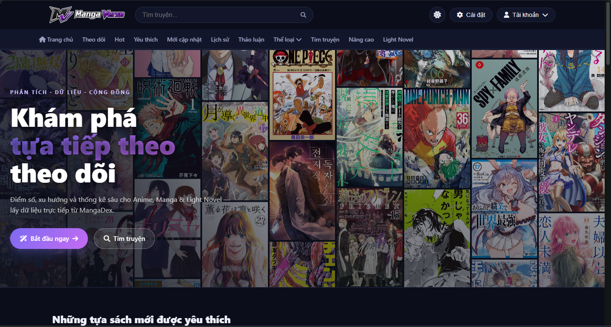

# MangaVerse — Django + MangaDex API

<p align="center">
  
</p>

Website đọc truyện tranh viết bằng Django, lấy toàn bộ dữ liệu (truyện, bìa,
danh sách chương, ảnh từng trang) trực tiếp từ **MangaDex API công khai**
(`https://api.mangadex.org`) — không cần database riêng cho nội dung truyện.

Giao diện tối (dark theme), có hero section lớn kèu lưới bìa truyện làm nền,
và hiệu ứng cuộn "bay lên từ dưới" (fade + slide-up) cho các thẻ truyện /
mục khi chúng xuất hiện trong màn hình, dùng `IntersectionObserver`.

Screenshots
-------------
<p align="center">
  
</p>

>Giao diện được tổng hợp và lấy ý tưởng từ:
> - Dự án [TruyenDex](https://github.com/zennomi/truyendex) của bác [Zennomi](https://www.facebook.com/search/top?q=zennomi)
> - [MangaDex](https://mangadex.org/)
> - [Lidex](https://wibubros.id.vn/) của fanpage [Wibu Bros Vietnam](https://www.facebook.com/wibubros)

## Cấu trúc project

```
mangaweb/
├── manage.py
├── requirements.txt
├── mangaweb/            # settings, urls gốc
└── reader/               # app chính
    ├── services.py       # wrapper gọi MangaDex API + chuẩn hoá dữ liệu
    ├── views.py           # home, search, manga_detail, chapter_read
    ├── urls.py
    ├── templates/reader/  # base, home, search, manga_detail, chapter_read
    └── static/reader/     # css/style.css, js/main.js (scroll-reveal)
```

## Tính năng mới: Đăng nhập / Đăng ký / Đăng nhập Google / Thể loại

- **Đăng nhập, Đăng ký** bằng username/email + mật khẩu — dùng `django-allauth`.
- **Đăng nhập bằng Google** (OAuth2) — cũng qua `django-allauth`, xem hướng dẫn cấu hình bên dưới.
- **Theo dõi / Yêu thích**: nút bấm trên trang chi tiết truyện, lưu vào bảng
  `Bookmark` riêng của site (vì MangaDex API công khai không cho ghi dữ liệu
  vào tài khoản MangaDex thật của người dùng).
- **Lịch sử đọc**: tự động lưu (bảng `ReadingHistory`) mỗi khi tài khoản đã
  đăng nhập mở một chương — chỉ giữ chương gần nhất cho mỗi truyện.
- **Thể loại**: dropdown ở thanh nav thứ 2 lấy trực tiếp từ
  `GET /manga/tag` của MangaDex (cache 12 giờ), có cả trang `/the-loai/`
  liệt kê đầy đủ theo nhóm (genre/theme/format/content) và trang lọc
  `/the-loai/<tag_id>/`.

## Tính năng mới: mục "Cài đặt" trên navbar

Dropdown **⚙️ Cài đặt** (không cần đăng nhập, lưu vào session trình duyệt):

- **🌍 Quốc gia truyện gốc** — lọc theo `originalLanguage` của MangaDex
  (Nhật/Manga, Hàn/Manhwa, Trung/Manhua, Hồng Kông, tiếng Anh gốc). Chọn
  **"Tất cả"** thì mọi trang (Trang chủ, Hot, Tìm kiếm, Thể loại) hiển thị
  y như trang gốc mangadex.org, không lọc gì cả.
- **📖 Kích thước trang đọc** — Nhỏ / Vừa / Lớn / Toàn màn hình, áp dụng
  ngay cho chiều rộng ảnh ở trang đọc chương (`/truyen/<id>/chuong/<id>/`).

Cả 2 lựa chọn áp dụng ngay khi đổi (không cần bấm nút Lưu) và được nhớ
xuyên suốt phiên duyệt web (Django session) — không lưu vào DB nên không
cần tài khoản.

## Cài đặt & chạy thử

```bash
cd mangaweb
python -m venv venv
source venv/bin/activate        # Windows: venv\Scripts\activate

pip install -r requirements.txt

python manage.py makemigrations reader   # tạo migration cho Bookmark / ReadingHistory
python manage.py migrate                 # tạo db.sqlite3 (tài khoản, session, theo dõi, lịch sử...)
python manage.py createsuperuser         # (tuỳ chọn) để vào /admin/
python manage.py runserver
```

Mở trình duyệt: **http://127.0.0.1:8000/**

## Cấu hình đăng nhập Google (qua file `.env`)

1. **Tạo file `.env`** ở thư mục gốc (cùng cấp `manage.py`), copy từ mẫu:
   ```bash
   cp .env.example .env
   ```

2. **Tạo OAuth Client trên Google Cloud Console**
   - Vào https://console.cloud.google.com/apis/credentials → tạo project (nếu chưa có)
   - **Create Credentials → OAuth client ID** → chọn **Web application**
   - *Authorized redirect URIs*, thêm:
     `http://127.0.0.1:8000/accounts/google/login/callback/`
     (khi deploy thật thì đổi domain cho đúng)
   - Copy lại **Client ID** và **Client secret**.

3. **Điền vào `.env`**:
   ```env
   GOOGLE_CLIENT_ID=xxxxxxxx.apps.googleusercontent.com
   GOOGLE_CLIENT_SECRET=xxxxxxxxxxxxxxxx
   ```

4. Khởi động lại `python manage.py runserver` — vậy là xong, **không cần vào
   `/admin/` tạo Social Application nữa**. `settings.py` tự đọc 2 biến này
   từ `.env` và cấu hình thẳng cho allauth (`SOCIALACCOUNT_PROVIDERS['google']['APP']`).

> Chưa điền `.env` thì nút "Đăng nhập bằng Google" sẽ tự ẩn đi và trang login
> hiện dòng cảnh báo màu vàng thay vì lỗi 500 — bạn vẫn dùng được
> đăng nhập/đăng ký thường bằng username + mật khẩu.
>
> **Lưu ý bảo mật:** file `.env` đã có sẵn trong `.gitignore`, tuyệt đối
> không commit file này lên git hay chia sẻ công khai vì nó chứa
> Client Secret thật.

### Lỗi `allauth.socialaccount.models.SocialApp.DoesNotExist`
Nếu bạn từng thấy lỗi 500 này ở `/accounts/login/`: đó là lỗi của bản cũ
(cấu hình Google qua Django admin). Bản hiện tại chuyển hẳn sang đọc từ
`.env` như hướng dẫn trên nên sẽ không còn gặp lỗi này nữa.

> Cần có kết nối Internet vì mọi dữ liệu truyện (danh sách thịnh hành, tìm
> kiếm, bìa, chương, ảnh trang) đều được gọi trực tiếp từ `api.mangadex.org`
> và `uploads.mangadex.org` mỗi khi có request (có cache 5 phút trong bộ nhớ
> qua `django.core.cache` để đỡ gọi API liên tục).

## Các trang đã làm

| Trang | URL | Mô tả |
|---|---|---|
| Trang chủ | `/` | Hero + lưới bìa nền, danh sách "Thịnh hành" & "Mới cập nhật" |
| Tìm kiếm | `/tim-kiem/?q=...` | Tìm truyện theo tên qua MangaDex |
| Chi tiết truyện | `/truyen/<manga_id>/` | Bìa, tác giả, mô tả, tag, danh sách chương |
| Đọc truyện | `/truyen/<manga_id>/chuong/<chapter_id>/` | Đọc từng trang (cuộn dọc), điều hướng chương trước/sau |

## Animation "từ dưới lên"

Xem `reader/static/reader/js/main.js` + class `.reveal-up` trong
`style.css`: mọi phần tử có class `reveal-up` mặc định `opacity: 0` và
`translateY(48px)`. Khi phần tử cuộn vào khung nhìn, `IntersectionObserver`
gắn thêm class `in-view` để nó fade + trượt lên vị trí gốc. Các thẻ trong
cùng một grid (`manga-grid`) được gán biến CSS `--stagger` tăng dần để tạo
hiệu ứng xuất hiện lệch nhịp (staggered) thay vì bật lên cùng lúc.

## Có thể mở rộng thêm

- Thêm trang lọc theo thể loại (`GET /manga?includes[]=tag`).
- Lưu lịch sử đọc / bookmark bằng model Django + tài khoản người dùng riêng
  (MangaDex OAuth chỉ cần nếu bạn muốn đồng bộ theo dõi/thư viện của chính
  tài khoản MangaDex người dùng).
- Chuyển cache từ `LocMemCache` mặc định sang Redis nếu deploy nhiều worker.
- Thêm chế độ đọc "data-saver" (ảnh nén) bằng cách truyền `data_saver=True`
  vào `services.get_chapter_pages()`.

## Lưu ý bản quyền / chính sách MangaDex

Dự án này được thực hiện hoàn toàn với mục đích học tập, nghiên cứu công nghệ (Django + API) và tham khảo từ nhiều nguồn mở khác nhau. Dự án hoàn toàn phi thương mại và không sử dụng cho bất kỳ mục đích kinh doanh nào.

MangaDex yêu cầu ghi công MangaDex và nhóm dịch (scanlation group) của từng
chương, không được chèn quảng cáo hoặc thu phí trên nội dung lấy từ API của
họ. Footer của site đã có dòng ghi công; nếu triển khai công khai, bạn nên
đọc kỹ Acceptable Usage Policy tại [API MangaDex](https://api.mangadex.org/docs/).